## Linear regressions: absolute [protein] vs. leaf water content (%)

# Summary stats for linear models

|            |submodel                                                |R2             |pval          |p.adj             |
|:-----------|:-------------------------------------------------------|:--------------|:-------------|:-----------------|
|2           |lipid_metabolism                                        |0.134          |0.00          |0.000000          |
|1           |abiotic_stress                                          |0.105          |0.00          |0.000000          |
|27          |stress                                                  |0.092          |0.00          |0.000000          |
|10          |biotic_stress                                           |0.070          |0.00          |0.000000          |
|7           |protein                                                 |0.060          |0.00          |0.000000          |
|21          |DNA                                                     |0.059          |0.00          |0.000000          |
|22          |HSPs                                                    |0.054          |0.00          |0.000000          |
|9           |signalling                                              |0.041          |0.00          |0.000000          |
|6           |secondary_metabolism                                    |0.038          |0.00          |0.000000          |
|18          |polyamine_metabolism                                    |0.037          |0.01          |0.023333          |
|4           |PSII                                                    |0.036          |0.01          |0.023333          |
|12          |Photosystems                                            |0.029          |0.01          |0.023333          |
|25          |protein_folding                                         |0.020          |0.04          |0.086154          |
|26          |Light_reactions                                         |0.018          |0.05          |0.100000          |
|17          |Rubisco                                                 |0.017          |0.06          |0.112000          |
|19          |Photorespiration                                        |0.008          |0.19          |0.332500          |
|13          |glycolysis                                              |0.007          |0.21          |0.345880          |
|14          |Calvin_cycle                                            |0.006          |0.27          |0.378000          |
|16          |TCA_org_transformation                                  |0.006          |0.25          |0.378000          |
|23          |PSI                                                     |0.006          |0.26          |0.378000          |
|8           |redox                                                   |0.005          |0.33          |0.440000          |
|28          |ATP_synthase_chloroplastic                              |0.004          |0.39          |0.496360          |
|11          |electron_transport_minATPsynth                          |0.002          |0.54          |0.657390          |
|3           |Cytochrome_b6f                                          |0.001          |0.63          |0.735000          |
|15          |hormone_metabolism                                      |0.001          |0.66          |0.739200          |
|5           |mitochondrial_electron_transport_ATP_synthesis          |0.000          |0.89          |0.890000          |
|20          |total_protein                                           |0.000          |0.77          |0.798520          |
|24          |RNA                                                     |0.000          |0.77          |0.798520          |

# Linear regressions

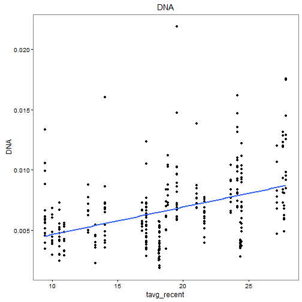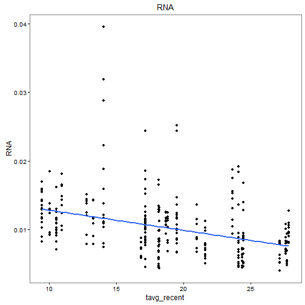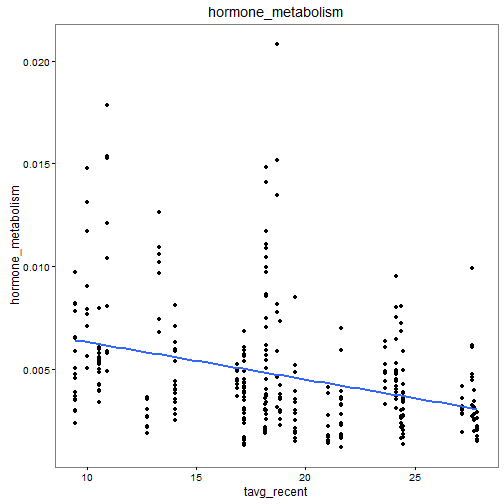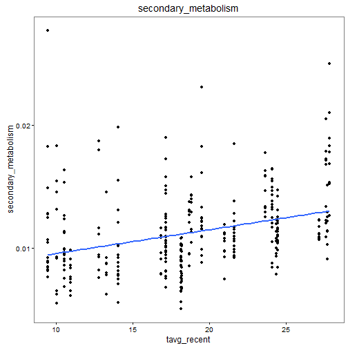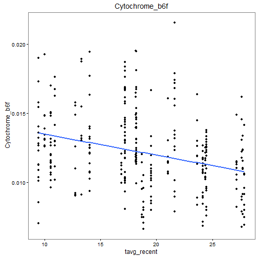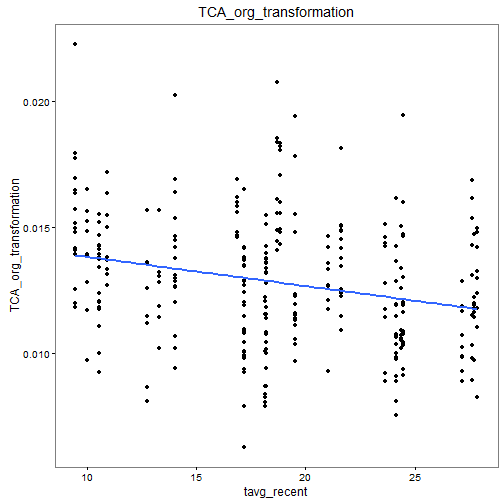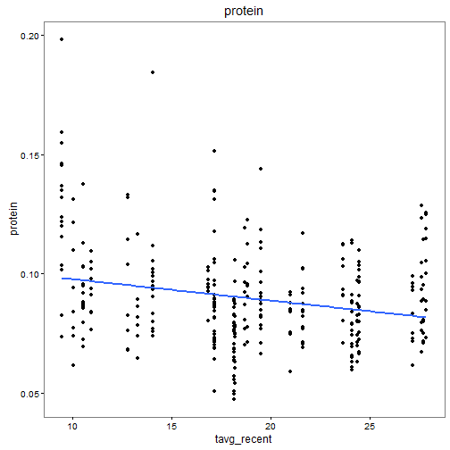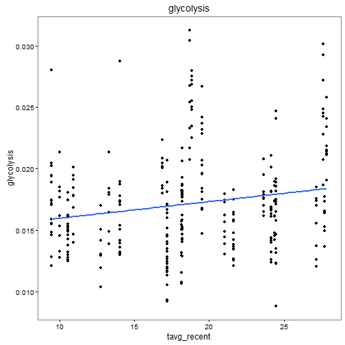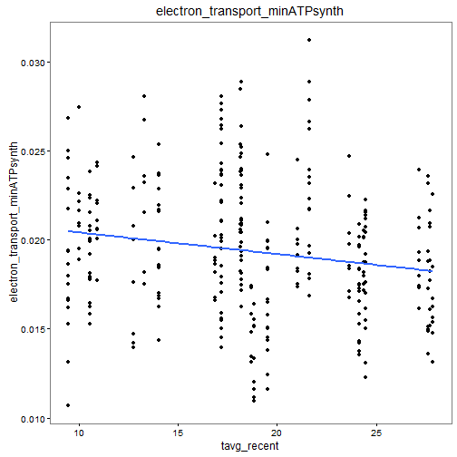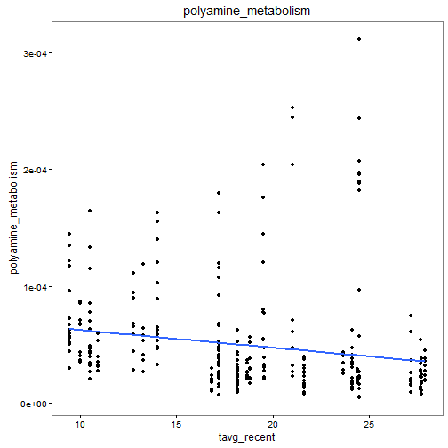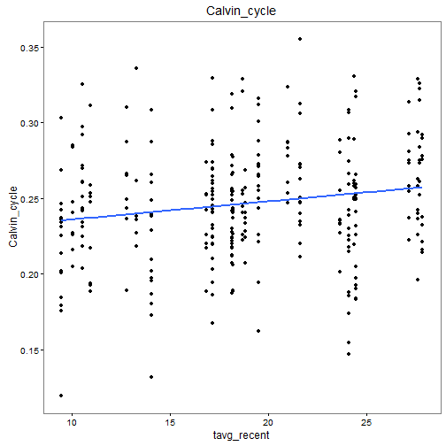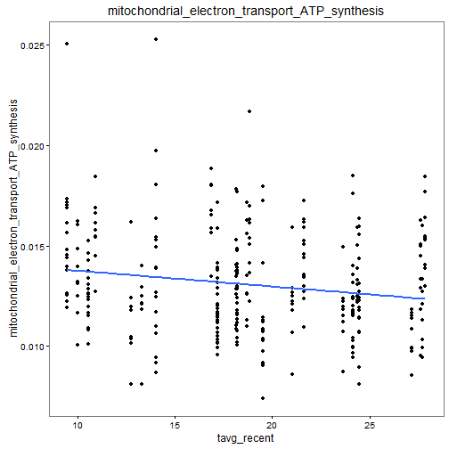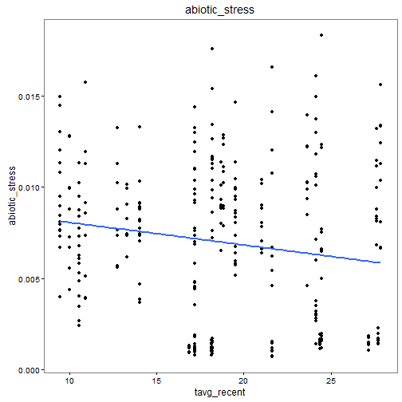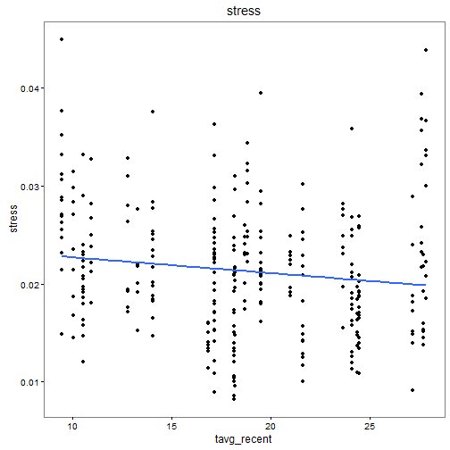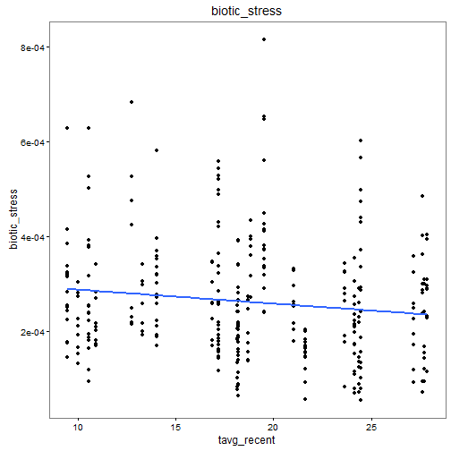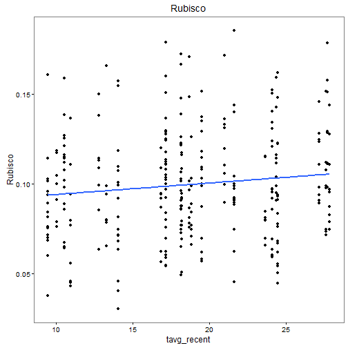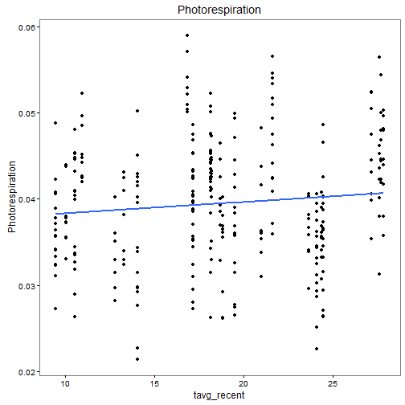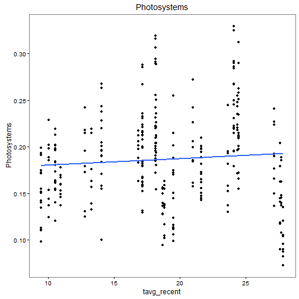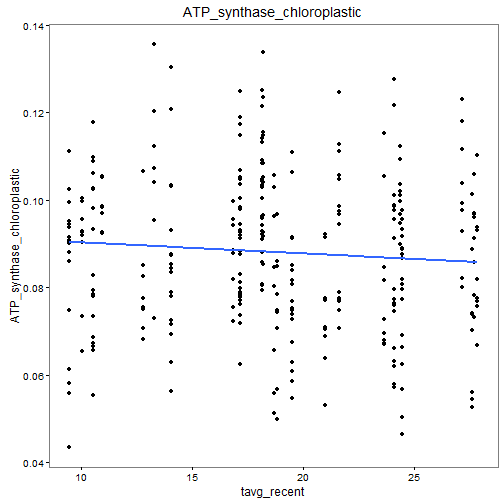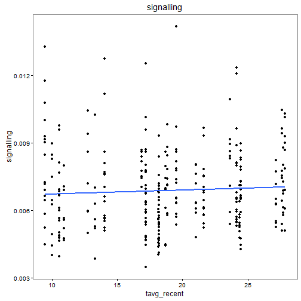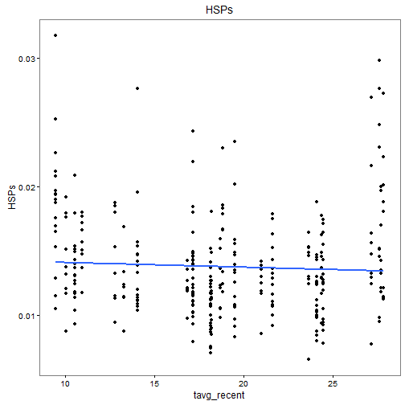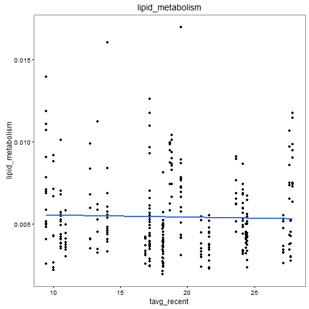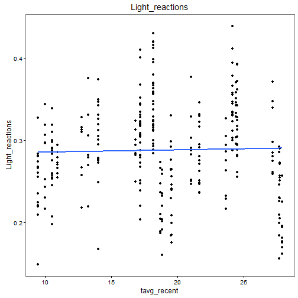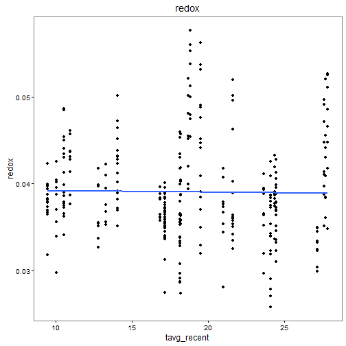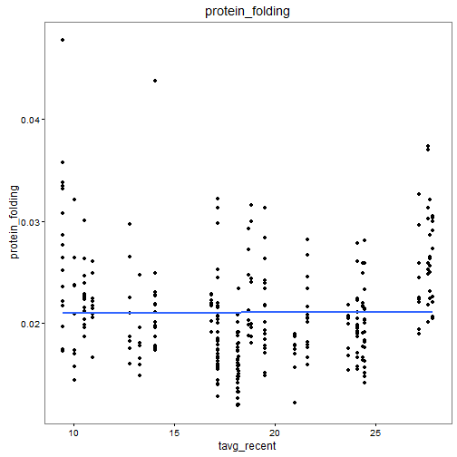
